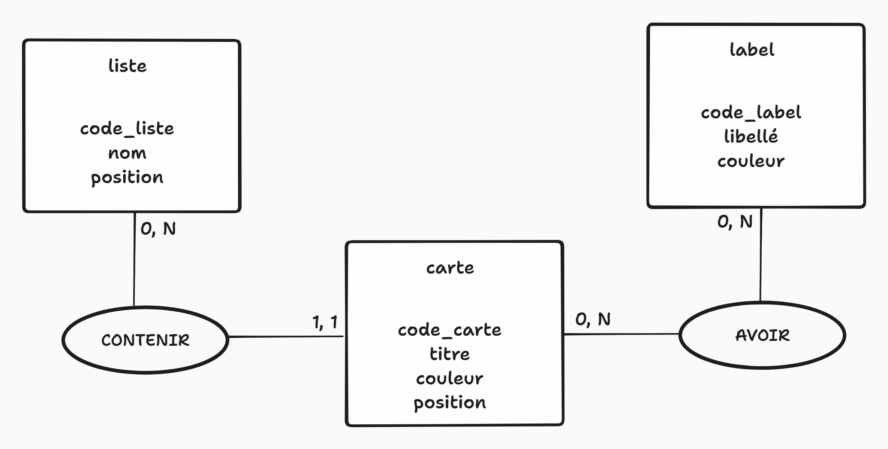

# Analyse du besoin client

On veut une app de board Kaban :

- Autant de liste qu'on le souhaite
- Une liste doit avoir un nom
- Une liste doit avoir une position

- Autant de cartes qu'on le souhaite
- Les cartes doivent se trouver dans une liste
- Une carte doit avoir un titre
- Une carte doit avoir une position au sein de sa liste
- Une carte peut avoir 0 ou 1 couleur
- Une carte peut avoir 0 ou N labels

- Possibilité de gérer des labels ?

## Users stories

Par ici pour [les users stories](./user_stories.md)

## MCD

Il se dégage clairement 3 entités suite à notre analyse :

- Liste
- Carte
- Label

On peut également réflechir à rajouter des entités pour nos V2 & V3 (User et autres)

